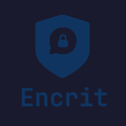

<p align="center">
  
</p>

<h1 align="center">Encrit Messenger</h1>

<p align="center">
  Your messages. Your rules.
</p>

<p align="center">
  <a href="README.md"></a>
  <a href="README_EN.md"></a>
</p>

## Features

* End-to-end encryption for all messages
* Local server — your data never leaves your network
* Password protection — only people with the password can read messages
* Simple and intuitive interface

## Download

1. Go to the [Releases](https://github.com/Forki303/Encrit-Messenger/releases) section.
2. Download the appropriate file:
   - **Windows** — `.exe`
   - **Linux** — executable file (no extension)
3. Run the program.

No additional installation required.

### Alternative: Build from source

```bash
git clone https://github.com/Forki303/Encrit-Messenger.git
cd Encrit-Messenger
pip install -r requirements.txt
pyinstaller --noconsole --onefile --name "Encrit Messenger" --icon Encrit.png --add-data="Encrit.png:." main.py
```

The built file will appear in the `dist/` folder.

## Getting Started

1. Set your nickname and password in the sidebar.
2. Click **Start Server** to create a chat, or **Connect** to join an existing one.
3. Chat away — all messages are encrypted automatically.

## How It Works

* The server runs on one of the participants.
* Others connect using IP and port.
* All messages are encrypted on the sender's side and decrypted on the receiver's side.
* The server only sees encrypted data — reading it without the password is impossible.

## Security

* Encryption based on `PBKDF2` + `HMAC-SHA256`
* The password is never transmitted over the network
* The server has no access to decrypted messages

## Project Structure

```
├── main.py          # Entry point
├── gui.py           # User interface (PySide6 / Qt)
├── crypto.py        # Encryption and decryption
├── network.py       # Network layer (client/server)
├── requirements.txt # Dependencies
├── Encrit.png       # Application icon
└── docs/            # Project website
```
